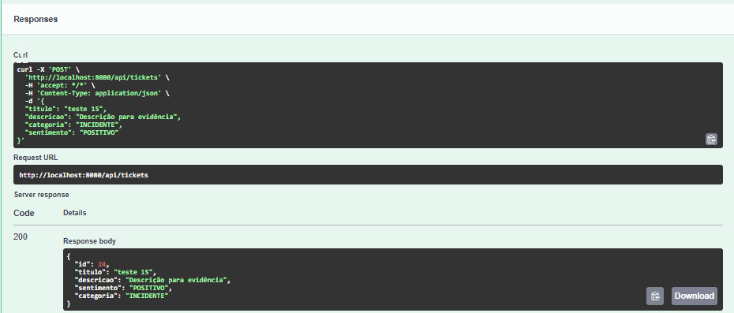
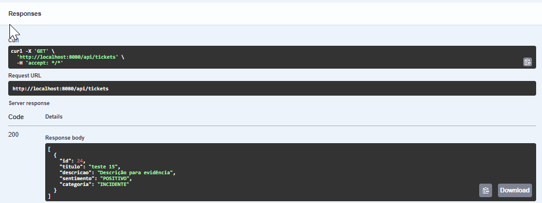
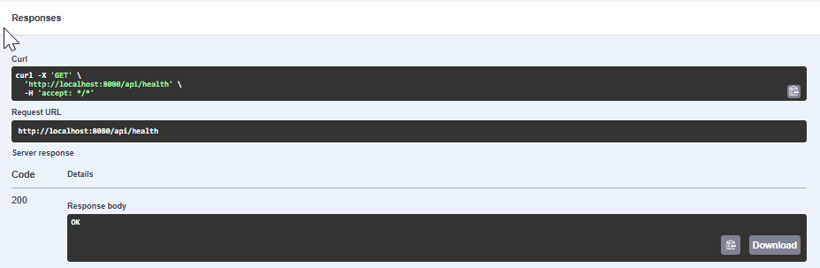
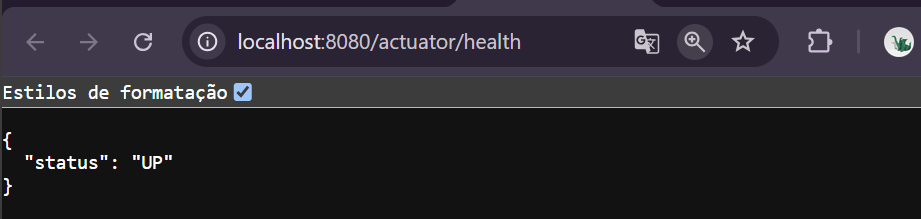

# Chamados API

Projeto desenvolvido como parte da segunda etapa do processo seletivo da empresa XXX. Esta API tem como objetivo gerenciar chamados de serviço em ambiente corporativo, permitindo o cadastro, atualização e listagem de ocorrências.

## Sumário

[1. Tecnologias utilizadas](#tecnologias)  
[2. Jusificativa das tecnologias utilizadas](#justificativa-das-tecnologias-utilizadas)  
[3. Estrutura de Pacotes](#estrutura-de-pacotes)  
[4. Configuração e Execução](#configuração-e-execução)  
  - [4.1 Pré-requisitos](#pré-requisitos)  
  - [4.2 Clonar o Repositório](#1-clonar-o-repositório)  
  - [4.3 Banco de Dados (PostgreSQL)](#2-banco-de-dados-postgresql)  

[5. Build e Execução](#build-e-execução)  
  - [5.1 Executar a aplicação](#executar-a-aplicacao)  
  - [5.2 Executar Testes](#executar-testes)  
  - [5.3 Endpoints e Exemplos de Uso](#endpoints-e-exemplos-de-uso)  
  - [5.4 Documentação Swagger](#documentação-swagger)  
  - [5.5 Health Check](#health-check)  
  - [5.6 Evidências de testes manuais](#evidencias-de-testes-manuais)  
  
[6. Notas Finais](#notas-finais)  

## 1. Tecnologias utilizadas

- **Java 21**  
- **Spring Boot 3.2.5**  
- **Maven**  
- **PostgreSQL**  
- **Lombok**  
- **Spring Data JPA**  
- **Spring Validation**  
- **Spring Boot Actuator**  
- **Swagger/OpenAPI**  
- **Docker & Docker Compose**  
- **JUnit + Mockito**  

## 2. Jusificativa das tecnologias utilizadas

A escolha das tecnologias foi orientada pelos temas abordados na primeira fase do processo seletivo, que avaliava a familiaridade e o tempo de experiência dos candidatos com determinadas ferramentas. Também foram consideradas as tecnologias mencionadas na descrição do desafio, partindo do pressuposto de que são amplamente utilizadas no dia a dia da empresa.

Para as tecnologias que não foram explicitamente citadas, a seleção priorizou ferramentas consolidadas no mercado, que complementam a stack proposta com foco em qualidade, manutenibilidade e boas práticas de desenvolvimento.

## 3. Estrutura de Pacotes

```plaintext
chamados-api
├── docker-compose.yml
├── pom.xml
├── README.md
├── src
│   ├── main
│   │   ├── java
│   │   │   └── br
│   │   │       └── com
│   │   │           └── nomeempresa
│   │   │               └── chamados_api
│   │   │                   ├── ChamadosApiApplication.java
│   │   │                   ├── config
│   │   │                   ├── controller
│   │   │                   ├── dto
│   │   │                   ├── model
│   │   │                   ├── repository
│   │   │                   └── service
│   │   │                       ├── implementation
│   │   │                       └── interfaces
│   │   └── resources
│   │       ├── application.properties
│   │       ├── static
│   │       └── templates
│   └── test
│       └── java
│           └── br
│               └── com
│                   └── nomeempresa
│                       └── chamados_api
│                           ├── ChamadosApiApplicationTests.java
│                           ├── controller
│                           └── service

```


## 4. Configuração e Execução

### 4.1 Pré-requisitos

- Java 21+
- Git
- Docker + Docker Compose
- PostgreSQL local ou container
- IntelliJ IDEA ou VS Code

### 4.2 Clonar o Repositório

```bash
git clone https://github.com/thayanaferreira/chamados-api.git
cd chamados-api
```

### 4.3 Banco de Dados (PostgreSQL via Docker)

Crie `docker-compose.yml`:

```yaml
version: '3.8'

services:
  postgres:
    image: postgres:15
    container_name: postgres-chamados
    restart: always
    environment:
      POSTGRES_DB: chamadosdb
      POSTGRES_USER: desafio
      POSTGRES_PASSWORD: 123456
    ports:
      - "5432:5432"
    volumes:
      - postgres_data:/var/lib/postgresql/data

volumes:
  postgres_data:
```

Inicie com:

```bash
docker-compose up -d
```

Para parar:

```bash
docker-compose down
```

Credenciais no `application.properties`:

```properties
spring.datasource.url=jdbc:postgresql://localhost:5432/chamadosdb
spring.datasource.username=desafio
spring.datasource.password=123456
spring.jpa.hibernate.ddl-auto=update
```

## 5. Build e Execução

### 5.1 Executar a aplicação:
```bash
# Windows
mvnw.cmd clean install
mvnw.cmd spring-boot:run

# Linux/macOS
./mvnw clean install
./mvnw spring-boot:run
```

### 5.2 Executar Testes

```bash
# Windows
mvnw.cmd test

# Linux/macOS
./mvnw test
```


### 5.3 Endpoints e Exemplos de Uso

São 3 endpoits de negócio:
| Método | Rota                  | Descrição                          |
|--------|-----------------------|------------------------------------|
| GET    | `/api/tickets`        | Lista todos os tickets             |
| POST   | `/api/tickets`        | Cria um novo ticket                |
| PUT    | `/api/tickets/{id}`   | Atualiza um ticket existente       |


#### Listar:

```bash
curl -X GET http://localhost:8080/api/tickets
```

#### Exemplo - Criar:

```bash
curl -X POST http://localhost:8080/api/tickets   -H "Content-Type: application/json"   -d '{
    "titulo": "Erro no login",
    "descricao": "Tela trava ao entrar",
    "categoria": "INCIDENTE",
    "sentimento": "NEGATIVO"
  }'
```

#### Exemplo - Atualizar:

```bash
curl -X PUT http://localhost:8080/api/tickets/1   -H "Content-Type: application/json"   -d '{
    "titulo": "Atualizando título",
    "descricao": "Resolvido no patch",
    "categoria": "INCIDENTE",
    "sentimento": "POSITIVO"
  }'
```

#### Erro de Validação (400):

Deixar qualquer um dos 4 campos sem prencher nada, mandando "vazio".  
Ou, preencher os campos categoria e sentimento, mas diferente dos valores esperados (foram mapeados como enum).

```json
{
  "titulo": "",
  "descricao": "",
  "categoria": "",
  "sentimento": ""
}
```

### 5.4 Documentação Swagger

[http://localhost:8080/swagger-ui.html](http://localhost:8080/swagger-ui.html)

### 5.5 Health Check

[http://localhost:8080/actuator/health](http://localhost:8080/actuator/health)

### 5.6 Evidências de testes manuais:

Observação: Embora o README tradicionalmente não seja o local apropriado para armazenar evidências de testes manuais, esta inclusão foi feita exclusivamente para fins avaliativos, com o objetivo de facilitar a verificação e compreensão do funcionamento da aplicação por parte da equipe responsável pela análise.

#### Todos os 4 endpoists que foram implementados:  


#### POST:


#### GET:


#### PUT:


#### Health Check da aplicação:




#### Um exemplo do tratamento que foi aplicado nos logs:

```plaintext
2025-06-02 15:41:36 [http-nio-8080-exec-10] INFO  b.c.n.c.config.RequestLoggingFilter - ➡️  [PUT] /api/tickets/30  
2025-06-02 15:41:36 [http-nio-8080-exec-10] INFO  b.c.n.c.controller.TicketController - PUT /api/tickets/30 - payload recebido: TicketDTO(titulo=alteração id 24, descricao=alterando descrição, categoria=OUTROS, sentimento=NEUTRO)  

Hibernate:  
    select
        t1_0.id,
        t1_0.categoria,
        t1_0.descricao,
        t1_0.sentimento,
        t1_0.titulo
    from
        ticket t1_0
    where
        t1_0.id=?  

2025-06-02 15:41:36 [http-nio-8080-exec-10] WARN  b.c.n.c.c.GlobalExceptionHandler - Recurso não encontrado em /api/tickets/30: Ticket com ID 30 não encontrado  
2025-06-02 15:41:36 [http-nio-8080-exec-10] WARN  o.s.w.s.m.m.a.ExceptionHandlerExceptionResolver - Resolved [jakarta.persistence.EntityNotFoundException: Ticket com ID 30 não encontrado]  
2025-06-02 15:41:36 [http-nio-8080-exec-10] INFO  b.c.n.c.config.RequestLoggingFilter - ⬅️  [PUT] /api/tickets/30 - Status: 404  

```
## 6. Notas Finais

- Em produção, use variáveis de ambiente para credenciais.
- Defina `ddl-auto=validate` para evitar alterações acidentais no banco.

---

### Autor(a):
👩‍💻 Construído por: **Thayana Ferreira**  
📎 [LinkedIn](https://www.linkedin.com/in/thayanaferreira)

---


